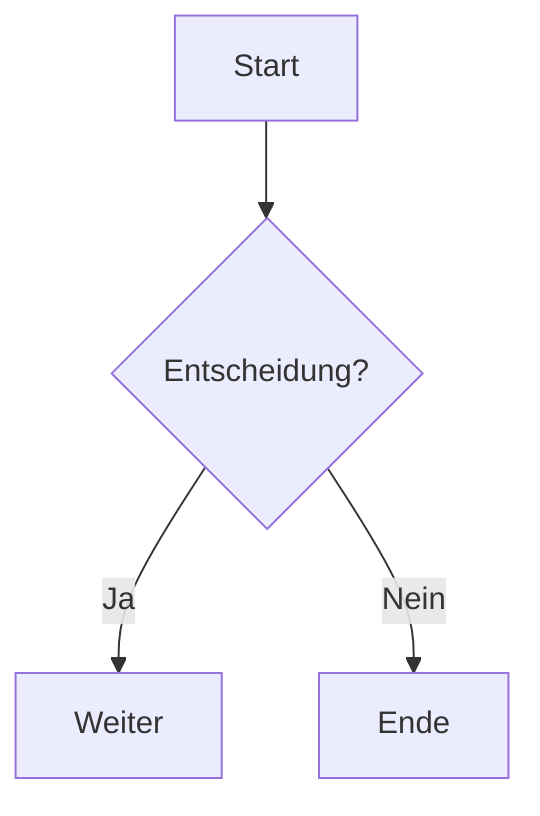

# 🧱 Markdown Best Practices

Markdown-Dateien sind einfach, aber können sehr mächtig sein, wenn sie gut strukturiert sind.  
Hier sind bewährte Vorgehensweisen für professionelle Dokumentation (z. B. für GitHub, Wikis oder interne Doku).

---

## 🧩 Grundstruktur

1. **Titel** (`# H1`)
2. **Kurze Beschreibung**  
3. **Inhaltsverzeichnis** (manuell oder mit Plugin)
4. **Abschnitte mit logischen Überschriften**
5. **Code, Tabellen, Bilder, Zitate** wo sinnvoll
6. **Abschluss / Kontakt / Lizenz**

---

## 🪶 Formatierung

| Zweck | Syntax | Beispiel |
|--------|---------|-----------|
| **Fett** | `**Text**` | **Wichtig** |
| *Kursiv* | `*Text*` | *Betonung* |
| `Code` | `` `Code` `` | `npm install` |
| Codeblock | ``` ```bash``` | siehe unten |
| Blockquote | `> Text` | > Hinweis |
| Trennlinie | `---` | ——— |
| Checkbox | `- [x]` | - [x] Erledigt |

---

## 🧱 Codeblöcke

```bash
# Shell
npm install
```

```python
# Python
print("Hello World")
```

```json
{
  "apiUrl": "https://api.example.com"
}
```

---

## 🖼 Bilder & Diagramme

```markdown

```

> 💡 Tipp: Verwende relative Pfade (`./docs/img.png`) für GitHub-Kompatibilität.

---

## 📊 Tabellen

| Spalte A | Spalte B | Spalte C |
|-----------|-----------|-----------|
| Wert 1 | Wert 2 | Wert 3 |

---

## 🧩 Links

- [Externer Link](https://example.com)
- [Interner Link](./README.md)

---

## ⚠️ Hinweise & Tipps

> 💡 **Tipp:** Verwende Emojis, um wichtige Punkte hervorzuheben, aber sparsam!  
> ⚠️ **Warnung:** Kein HTML in Markdown, wenn vermeidbar – GitHub rendert nicht alles korrekt.

---

## 📘 Erweiterte Tools

**Mermaid-Diagramme:**



---

## 📄 Dokumentationsstil

- Verwende **aktive Sprache** („Führe den Befehl aus…“ statt „Der Befehl wird ausgeführt“)
- Strukturiere Inhalte mit **Überschriftenebenen**
- Nutze **Code-Kommentare** in Beispielen

---

## ✅ Checkliste für gute Markdown-Dateien

- [x] Übersichtliche Gliederung  
- [x] Einheitliche Formatierung  
- [x] Bilder/Code/Tabellen zur Veranschaulichung  
- [x] Relative Pfade für GitHub  
- [x] Lizenz & Kontaktinformationen  

---

_Ende_
